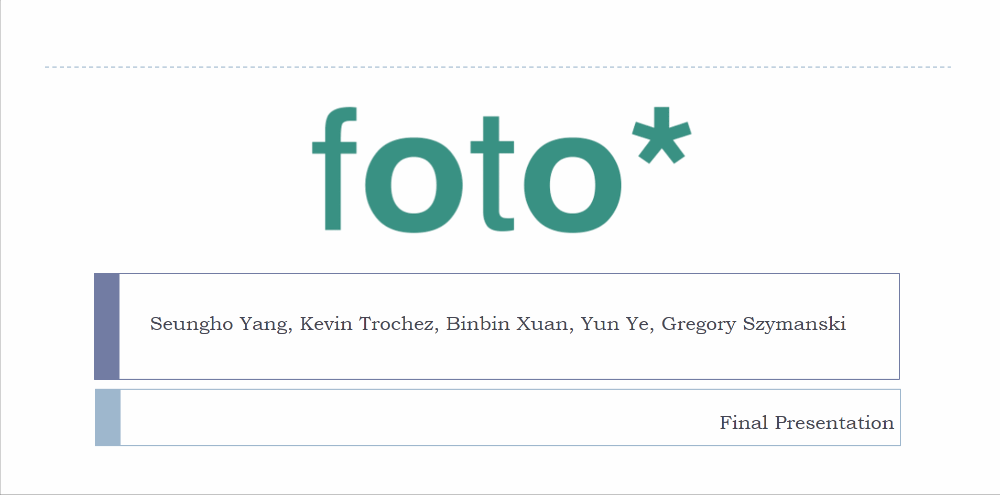

# Collection of college assignments 

In this repository I am collecting all my assignments that I have completed during my time at Baruch College. All of the projects included are related either to some tehnology or business subject, sometimes both. Under each directory you can find reports, descriptions and/or slides describing work that I often in collaboration with team members had to do to complete an assignment. Since certain projects have been done a while ago, I have lost some of the resources associated with them. I am in the process of retrieving as much documentation and scripts as possible. Even though some documents might be missing every folder includes some kind of document that provides what kind of project was it. Often the documentation provided was a big part of the project. Below I have provided brief description of each folder: 

# Project Descriptions

### 1. DataMining

DataMining contains a paper that I wrote for my Data Mining for Business Analytics course. 

### 2. DataWarehouse

DataWarehouse contains a report how my team worked on setting up a data warehouse.

### 3. Excel_Finance

Excel_Finance presents some example Excel spreadsheets that I worked with during my accouting and business classes. 

### 4. IntroductoryDBMS

IntroductoryDBMS contains my Access desktop database that I created for my Databases introductory course. 

### 5. ProjectManagement

ProjectManagement contains documentation for my Project Management class where I helped manage a team that worked on creating a web application. The plan was to create an inventory system for a small liqour store. ### Video Walkthrough

Here's a walkthrough of final report:

### 6. BusinessPolicy 

BusinessPolicy contains PowerPoint presentation slides that were used during my Business Policy project. The assignment was a semester long project that required my team to participate in a [Glo-Bus](https://new.glo-bus.com/) business simulation. The similuation required me and my team to run a company producing cameras and drones and compete with other teams in the industry. Through the period of the game we had to analyze our competition, their position in the market, their strenghts and weaknesses and based on that create our own competetive advantage and meat investors's expectations. Out of six competing teams my team has finished the game on second place. We managed to create a good long-term strategy and backed it up with healthy financial results. The game has imrpoved my organizational and analytical skills. It has also helped me become a better presenter and team player. 

### Video Walkthrough

Here's a walkthrough of how the Glo-Bus similutation looked during my game:

Here's a walkthrough of our Final Presentation slides:

